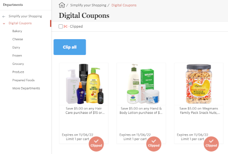

# Userscripts

Random useful userscripts:

* [wegmansClipAll](https://github.com/jrib/userscripts/raw/main/scripts/wegmansClipAll.user.js): Clip all [coupons](https://shop.wegmans.com/shop/coupons) at wegmans.com

    

## Installing Userscripts

1. Install [Violentmonkey](https://violentmonkey.github.io/).
2. Visit the raw `user.js` file in your browser and install it when prompted.

